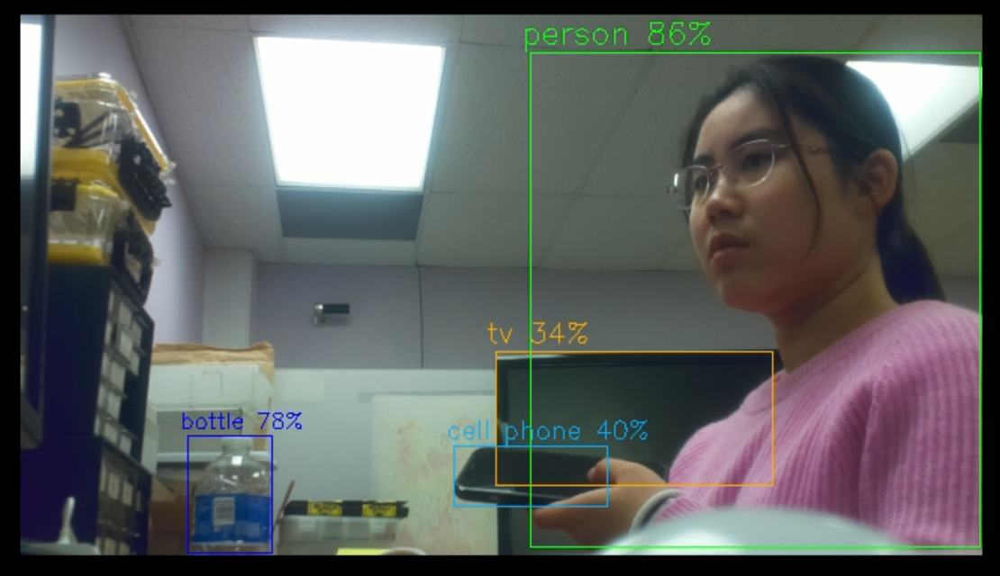
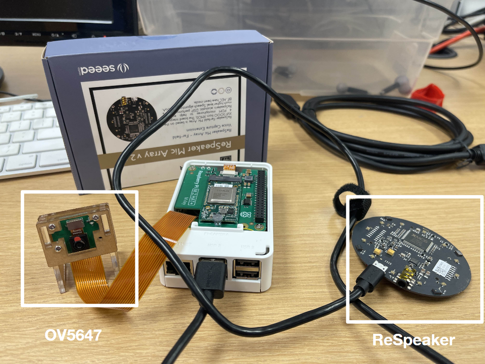

# Distributed IoT Database
#### by: Yaqi Liu, Jess Xu

The goal of our project is to allow home and business owners to be able to quickly gain an overview of the activity that occurs inside a given building or building complex, using low-cost/low-power sensors, cameras, and microcontrollers. To this end, a highly available distributed database is needed, as well as accurate classification of sound and images. 

Each node in our network consists of a Raspberry Pi with a camera and microphone that hosts a Redis vector database. Each entry contains a vector embedding and classification of an event, and nodes in the network are connected via a wireless LAN, using Redis Cluster to provide a highly available distributed database. 

We implement a minimal setup of multiple nodes on one Raspberry Pi to test the architecture of a distributed network, with local Redis masters and replicas that write to their respective databases, with failover capabilities. The image classification has 85.3% accuracy for person, bottle, and cell phone, and the microphone classification accuracy is 83.3% for typing, knock, silence, and speech. 

# Report 
* [Final [Report](https://github.com/jsxu315/ecem202a_distributediot/blob/main/docs/report.md)
