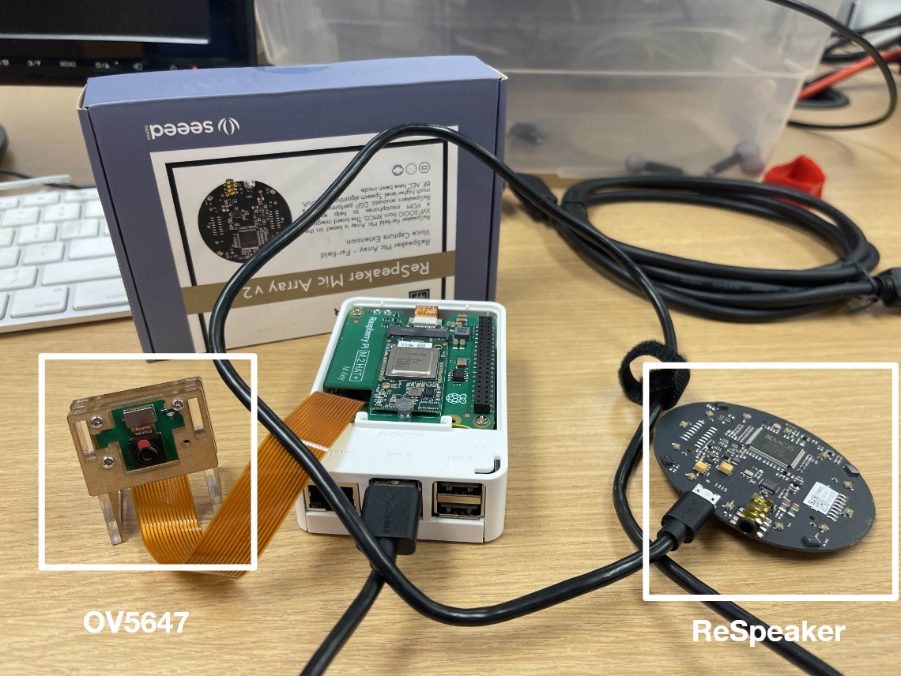
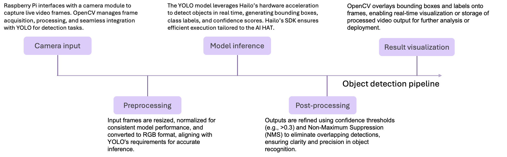

# Table of Contents
* Abstract
* [Introduction](#1-introduction)
* [Related Work](#2-related-work)
* [Technical Approach](#3-technical-approach)
* [Evaluation and Results](#4-evaluation-and-results)
* [Discussion and Conclusions](#5-discussion-and-conclusions)
* [References](#6-references)

# Abstract

The goal of our project is to allow home and business owners to be able to quickly gain an overview of the activity that occurs inside a given building or building complex, using low-cost/low-power sensors, cameras, and microcontrollers. To this end, a highly available distributed database is needed, as well as accurate classification of sound and images. 

Each node in our network consists of a Raspberry Pi with a camera and microphone that hosts a Redis vector database. Each entry contains a vector embedding and classification of an event, and nodes in the network are connected via a wireless LAN, using Redis Cluster to provide a highly available distributed database. 

We implement a minimal setup of multiple nodes on one Raspberry Pi to test the architecture of a distributed network, with local Redis masters and replicas that write to their respective databases, with failover capabilities. The image classification has 85.3% accuracy for person, bottle, and cell phone, and the microphone classification accuracy is 83.3% for typing, knock, silence, and speech. 

# 1. Introduction

Currently, people must individually examine the data for each sensor, and then determine what activities occurred (e.g. check garage and living room cameras to conclude that “a person moved from the garage to the living room”), since each unit would only store its own local, unprocessed data. 

We provide classification of data (e.g. “person seen on camera” or “car honk heard”), which reduces the need for users to manually comb over and process sensor data. We create one distributed database, which provides richer insight into the activity that is occurring (e.g. being able to track activity across different areas, or infer cause and effect)

For home and business owners, the project can reduce the time and labor needed to determine when certain events occurred in their buildings. This can be useful for ensuring safety or for collecting data about day-to-day usage. 

The main challenges are making accurate classifications and inferences. If our project makes inferences that are wrong (e.g. concluding that a person moved from room A to room B when in fact it was two different people), it could place a burden on the building owners to manually verify the data. Additionally, there is a concern of data privacy when transmitting sensor data between nodes. 

Each node in our project uses a Raspberry Pi 5 with AI Hat (to collect and process sensor data and host its database), a ReSpeaker 4-Mic Array, and a OV5647 Camera Module. Executing it will require knowledge of AI/ML classification; distributed databases; microprocessors, and limitations of embedded systems and edge computation. 

We measure the success of our project by the availability (uptime %) of our database, as well as the accuracy of classifications. 

# 2. Related Work

* **Portkey**[1] is a project that implemenents a distributed edge database using Redis Cluster, with nodes that are mobile (unlike in our project, in which nodes are stationary)  

* **SDKV: A Smart and Distributed Key-Value Store for the Edge-Cloud Continuum**[2] -- this paper also implements a distributed edge database, but it also intelligently determines where to place replicas and allows clients to choose between strong or eventual consistency. This ultimately allows more flexible customization of data availability, consistency, and latency, making it generalizable and scalable. Like Portkey, it uses Redis Cluster. We use ideas from this paper to implement our distributed database, but latency and scalability are not as much of a concern for the scale of our project. 

# 3. Technical Approach

We used the Raspberry Pi 5 AI Kit with a HAT+ Board. Since one of our top priorities was providing fast classification, we chose this board for its ability to deliver 13 TOPS (Tera Operations Per Second). For the camera, we used the OV5647 camera module for its relative low cost and ease of setup. However, most official camera modules are compatible and can be easily integrated with the Raspberry Pi 5. For the microphone, we used the SEEED ReSpeaker v2.0, a four-microphone array with a signal-to-noise ratio (SNR) of up to 61 dB, which is ideal for sound processing tasks. 

We wrote Python scripts to read data from the camera and microphone, taking 10-second samples every 30 seconds. Each event was written to a Redis database, which was hosted on the Raspberry Pi in a Docker container. 

For image classification, we used Hailo's machine learning techniques with the default YOLO model is trained on the COCO dataset, which contains 81 detectable objects -- we chose to focus on detecting a person, bottle, and cell phone for our project for ease of testing. Hailo is ideal for our project for several reasons: it performs model optimization, quantized models (INT8), pruning, and its Dataflow Compiler can optimize deep learning models (e.g., YOLO) for edge inference. It also supports neural acceleration; the NPU accelerates CNN-based models like YOLO, enabling real-time object detection with low power consumption and high performance. We also pre- and post-process images, and outputs are decoded with Non-Maximum Suppression (NMS) and confidence filtering for accurate results.

For sound classification, we used Mediapipe audio classification usingthe YAMNet model
YAMNet (Yet Another Mobile Network), a pre-trained deep learning model for audio event classification.
Based on the MobileNetV1 architecture, it efficiently processes audio spectrograms to classify sounds into 521 classes from the AudioSet ontology. 

YAMNet is pre-trained on Google's AudioSet dataset, which contains over 2 million human-labeled 10-second audio clips spanning diverse categories such as speech, music, and environmental sounds.

The model uses a Convolutional Neural Network (CNN) backbone to capture spatial and temporal patterns in audio signals, making it lightweight and suitable for devices like Raspberry Pi 5. Additionally, our use case is especially suited to using a CNN because it involves repetitive patterns that can be divided into predictably sized windows.YAMNet requires audio data to be preprocessed into 16 kHz mono waveforms for input. Then, the input audio must be resampled and segmented into overlapping windows (frame segmentation). Feature conversion is done by generating log Mel spectrograms using Short-Time Fourier Transform (STFT).

We used Redis Cluster to provide high reliability. Each node is assigned a range of hash slots; when a client writes to a node, that entry is routed to the correct master node. Crucially, each node only keeps a local database containing entries for its assigned hash slots. When clients issue a query, the request is routed to the correct node and then returned 

# 4. Evaluation and Results

The classification model and vector database runs successfully on one node. Our camera model has about 85.3% accuracy with the objects we selected (person, bottle, cell phone) and our microphone classification is about 83.3% (for typing, knock, silence, speech). On a single node, we are able to start a working cluster by hosting multiple local Redis masters and replicas that write to their respective databases, with failover capabilities. Future work involves scaling up to large networks with multiple Raspberry Pis. 

Our database had an uptime of 100% when tested for about 5-hour periods; we were unable to test for longer periods of time due to the Raspberry Pi overheating. In the minimal setup, all data was transmitted successfully (without loss) and maintained consistency, with latency of < 0.1 ms. However, we expect this latency to be longer in a realistic distributed setting. 

# 5. Discussion and Conclusions

We achieved real-time machine learning integration by effectively performing real-time object detection using the camera and sound classification with audio inputs, generating accurate JSON files for data representation. It successfully transmitted classified data to a local Redis database, which would allow for data aggregation and storage for further analysis in a future distributed setting.

We implemented a minimal distributed system using three nodes on one Raspberry Pi equipped with audio and visual sensors, ensuring comprehensive environmental monitoring. The system demonstrated robust node-to-node replication, maintaining data consistency and ensuring redundancy to safeguard against individual node failures. This distributed architecture shows potential for scalability, with the system adaptable to include additional nodes or integrate more advanced machine learning models for enhanced detection capabilities.

Future work involves inter-node communication, as we want to strengthen the reliability of the network by adding replicas and allowing them to be promoted in the case that a master goes down, fostering collaborative decision-making. We would also like to implement a load-balancing strategy where nodes dynamically redistribute tasks (e.g., image processing, audio classification) based on real-time computational loads and network conditions. Then, we could test expanding the system to accommodate additional nodes, and measure its performance to observe if it can provide synchronization and consistent performance across all nodes.

We also want to improve fault detection and recovery by developing a mechanism for nodes to detect failures in other nodes, automatically replicate missing data, and temporarily take over the broken node's responsibilities.

Finally, to increase the effective range of object and sound detection in settings that require it, we could enhance the hardware (e.g., using higher-resolution cameras or directional microphones). 

# 6. References

1. Joseph Noor, Mani Srivastava, and Ravi Netravali. 2021. Portkey: Adaptive Key-Value Placement over Dynamic Edge Networks. In Proceedings of the ACM Symposium on Cloud Computing (SoCC '21). Association for Computing Machinery, New York, NY, USA, 197–213. https://doi.org/10.1145/3472883.3487004 

2. Juan Aznar-Poveda, Tobias Pockstaller, Thomas Fahringer, Stefan Pedratscher, and Zahra Najafabadi Samani. 2024. SDKV: A Smart and Distributed Key-Value Store for the Edge-Cloud Continuum. In Proceedings of the IEEE/ACM 16th International Conference on Utility and Cloud Computing (UCC '23). Association for Computing Machinery, New York, NY, USA, Article 2, 1–8. https://doi.org/10.1145/3603166.3632126 
